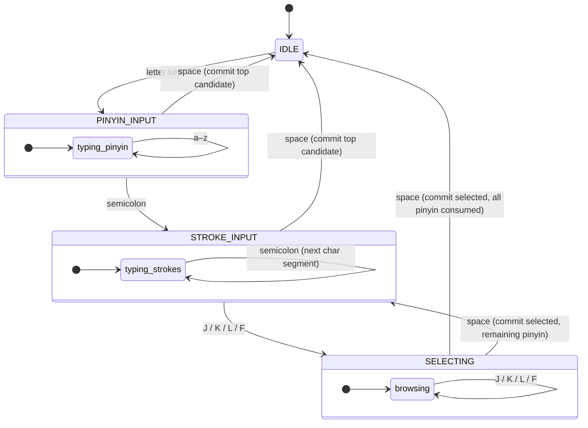

# Input Flow State Machine

Detailed design of the Predictable Pinyin input flow, mapping the README specification
to concrete implementation states and transitions.

## Overview

The input flow supports both single characters and words/phrases:

```
[Pinyin Phase] → [Stroke Phase] → [Selection Phase] → Text committed
```

Each phase is terminated by an explicit key press (`;` or J/K/L/F or SPACE).
In the stroke phase, each `;` advances stroke matching to the next character
position within a word candidate (per-character stroke narrowing).

## State Machine



### Modifier Key Handling (all states)

- **Ctrl+key**, **Alt+key**: always passed through to the application (e.g., Ctrl+C, Ctrl+V)
- **Shift toggle**: pressing and releasing Shift alone (no other key in between)
  toggles between Chinese and English mode. In English mode, all keys pass through unprocessed.

### State: IDLE

- No active input
- Any letter key → transition to PINYIN_INPUT
- `;` → output Chinese semicolon `；` (stays in IDLE)
- Other punctuation (`,` `.` `!` `?` `:` `\` `(` `)` `[` `]` `<` `>` `~`) →
  output Chinese equivalent (stays in IDLE)

### State: PINYIN_INPUT

- User is typing pinyin (e.g., `zhong` or `zhongguo`)
- Valid keys: a-z (lowercase letters), `'` (apostrophe as syllable separator)
- `;` key → finalize pinyin, transition to STROKE_INPUT
- Space key → commit top candidate directly (may be a word or character)
- No auto-end: user must always press `;` to enter strokes or SPACE to commit
- Candidates are shown live (Rime is queried incrementally) with `;` labels
- When the entire input is a valid single syllable (no apostrophe), only
  single-character candidates are shown; multi-char candidates are filtered out.
  Use `'` to explicitly separate syllables (e.g., `ni'ao` for 尼奥).
  Multi-syllable inputs that are NOT valid single syllables (e.g., `zhongguo`)
  naturally show word candidates without requiring `'`.
- Punctuation keys (except `;`) → commit top candidate + output Chinese punctuation

### State: STROKE_INPUT

- User types stroke keys to narrow down candidates by per-character strokes
- Valid keys: `h` (横), `s` (竖), `p` (撇), `n`/`d` (捺/点), `z` (折)
- `;` → advance to next character position (for word stroke narrowing)
- `J`/`K`/`L`/`F` → enter SELECTING with the corresponding delta applied
- Space → commit the top candidate directly (skip SELECTING)
- BACKSPACE → undo last stroke; if current segment empty, pop segment; if only
  segment is empty, return to PINYIN_INPUT
- Both word and single-character candidates participate in stroke filtering
- Stroke segments are matched per-character: segment 1 against char 1, etc.
- When multiple segments are used but Rime has no matching word, virtual word
  candidates are composed by decomposing the pinyin into syllables and combining
  the top single-character match at each position
- Candidate order is preserved from Rime after filtering
- Single-character candidates are filtered by exact pinyin match against the
  input (multi-character candidates trust Rime's pinyin filtering)
- Characters whose strokes exactly match the typed strokes are stably promoted
  above characters with only a prefix match
- Punctuation keys (except `;`) → commit top candidate + output Chinese punctuation

### State: SELECTING

- Candidates are displayed in the filtered Rime order
- Valid keys:
  - **J** → next candidate (skip 1)
  - **K** → 2nd next candidate (skip 2)
  - **L** → 4th next candidate (skip 4)
  - **F** → next page (10 candidates per page)
  - **Space** → commit the current candidate, return to IDLE
  - **BACKSPACE** → undo last selection action
- **Auto-skip**: if there's only one candidate, auto-commit immediately
- **Partial commit**: when the committed text consumes only part of the pinyin
  (e.g., committing 千 from `qianshan`), the remaining pinyin (`shan`) is
  re-entered and the machine transitions to STROKE_INPUT instead of IDLE

## Key Conflict Resolution

Stroke keys (`h`, `s`, `p`, `n`, `d`, `z`) and selection keys (`J`, `K`, `L`, `F`)
are disjoint sets, so both are valid in STROKE_INPUT simultaneously: lowercase
letters add strokes while uppercase letters enter SELECTING with a navigation
delta. `d` covers 点 plus the rising-hook strokes 提/挑 (hard to distinguish
from 点 visually, so they're folded into one key).

Stroke keys overlap with pinyin input letters. Since PINYIN_INPUT and
STROKE_INPUT are separated by an explicit space transition, this is unambiguous.

## Auto-Transition Rules

### Pinyin Phase

No auto-end: user must always press `;` to enter strokes or SPACE to commit.
The `PinyinTrie` still provides `ShouldAutoEnd` for informational purposes, but
the state machine does not use it to auto-transition.

### Stroke to Selecting

`J`/`K`/`L`/`F` in STROKE_INPUT immediately transitions to SELECTING with
the corresponding delta applied. If there are ≤1 candidates, these keys are
ignored (the user should use space to commit the top candidate).

### Direct Commit

SPACE in STROKE_INPUT commits the top candidate directly, bypassing SELECTING.
SPACE can also be pressed during PINYIN_INPUT to commit the top candidate in
one keystroke (skipping stroke disambiguation entirely).

## Display / Hints

Throughout the process, the input method should show:

1. **Current state indicator** — which phase the user is in
2. **Valid next keys** — what keys can be pressed and what they do
3. **Candidate preview** — current top candidate(s)
4. **Stroke hint** — show the stroke sequence of the top candidate to help users
   learn the stroke order

## Backspace Behavior

- In PINYIN_INPUT: remove last letter; if empty, return to IDLE
- In STROKE_INPUT: remove last stroke; if no strokes, return to PINYIN_INPUT
- In SELECTING: undo last navigation action (D key also does this); if at initial
  position, return to STROKE_INPUT

## Example Walkthrough

### Single character: 中 (zhōng, strokes: `szhs`)

1. **PINYIN_INPUT**: User types `z`, `h`, `o`, `n`, `g`, then `;`
2. **STROKE_INPUT**: Candidates: 中, 种, 重, ... → type `s` to narrow to 中
3. **SELECTING**: Use J/K/L/F to navigate, SPACE to commit

Quick commit: `z h o n g SPACE` commits the top candidate from pinyin phase.

### Word: 中国 (zhōngguó, 中=`szhs`, 国=`szzshh`)

1. **PINYIN_INPUT**: User types `z h o n g g u o`, then `;`
2. **STROKE_INPUT** (char 1): Type `s z` to narrow first character to 中
3. Press `;` to advance to char 2: Type `s z` to narrow second character to 国
4. SPACE commits 中国

Other patterns:
- `zhongguo SPACE` — commit top word directly
- `zhongguo ; s z ; s z SPACE` — narrow both characters
- `zhongguo ; ; s z SPACE` — skip first char, narrow second only
- `yuqian ; ddz ; ddz SPACE` — even if Rime has no "宇骞" word, virtual
  composition builds it from single characters 宇 + 骞

### Apostrophe: 尼奥 (ní ào)

- `niao SPACE` — "niao" is a valid single syllable → only single chars (鸟, 尿)
- `ni'ao SPACE` — apostrophe splits into "ni" + "ao" → word 尼奥 appears

### Exact stroke priority: 十 (shí, strokes: `hs`)

- `shi ; h s SPACE` — 十 (exact match "hs") ranks above 事 (prefix match "hs…")

### Partial commit: 千 from 千山

1. **PINYIN_INPUT**: `q i a n s h a n`, then `;`
2. **STROKE_INPUT**: candidates include 千山, 千, 山
3. Press `J` to select 千, then `SPACE`
4. 千 is committed; remaining "shan" is re-entered → STROKE_INPUT for `shan`

## Implementation Notes

This state machine will be implemented as a **custom C++ component** (by forking
Rime's client code if needed) that:

1. Intercepts keystrokes before Rime's default processing
2. Maintains state (current phase, accumulated pinyin, accumulated strokes)
3. In PINYIN_INPUT: delegates to Rime's speller for pinyin composition
4. In STROKE_INPUT: applies stroke filtering using stroke data (h/s/p/n/z keys)
5. In SELECTING: handles J/K/L/F/D navigation and space for commit

The component will need access to:
- A valid pinyin syllable trie (for auto-end detection)
- The stroke sequence database (for stroke filtering)
- The hanziDB frequency table (for candidate sorting)

## References

- [Project README](../README.md) — original specification
- [rime-framework.md](./rime-framework.md) — Rime engine architecture
- [stroke-data.md](./stroke-data.md) — stroke classification and data
- [character-database.md](./character-database.md) — hanziDB frequency data
