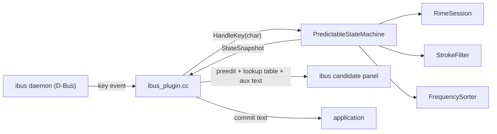

# Phase 8.2: ibus Input Method Engine (Linux)

Plan for the ibus engine that exposes Predictable Pinyin on Linux.

## Design Highlights

| Aspect | ibus |
|--------|------|
| Plugin model | Standalone executable communicating over D-Bus |
| API style | GObject class hierarchy (`IBusEngine` subclass) |
| Registration | XML component file in `/usr/share/ibus/component/` |
| Icon | Absolute file path in the component XML |
| Rime user data | `~/.config/ibus/rime/` |
| Build output | `ibus-engine-predictable-pinyin` (executable) |
| Dependencies | `libibus-1.0-dev` |
| Process lifecycle | Own process; GLib main loop via `ibus_main()` |

## Implementation Notes

1. **Icon resolution**: point the component XML at the installed SVG/PNG via an
   absolute path — no icon cache or theme directory juggling required.
2. **Key translation**: ibus passes standard X11 keysyms. Translate via the
   `IBUS_KEY_*` constants from `<ibus.h>`.
3. **Semicolon key**: map `IBUS_KEY_semicolon` explicitly so `;` reaches the
   state machine instead of being treated as punctuation by ibus.
4. **Test the icon on first install**: verify the icon shows up before moving on.

## Architecture



The engine is a standalone executable that:
1. Calls `ibus_init()` and connects to the ibus bus
2. Creates an `IBusFactory` and registers the engine type
3. Enters `ibus_main()` (GLib main loop)

When the user activates the input method, ibus creates an engine instance. Our
`IBusEngine` subclass holds a `PredictableStateMachine` backed by the shared
`pp_core` library.

## Files

New files:

| File | Purpose |
|------|---------|
| `src/ibus_plugin.cc` | IBusEngine subclass + main() entry point |
| `data/ibus/predictable-pinyin.xml.in` | Component XML template (exec path is configured by CMake) |
| `scripts/install-ibus.sh` | Build, install, deploy, restart helper |

Modified files:

| File | Change |
|------|--------|
| `CMakeLists.txt` | Add optional ibus executable target and install rules |
| `README.md` | Link to new `doc/dev-setup-ibus.md` |
| `doc/README.md` | Add index entry for this plan and ibus setup |
| `doc/plan.md` | Mark ibus as in-progress |

## Engine Implementation (`src/ibus_plugin.cc`)

### GObject Boilerplate

Define a custom `IBusPredictablePinyinEngine` struct extending `IBusEngine`:

```c++
struct IBusPredictablePinyinEngine {
  IBusEngine parent;
  PredictableStateMachine* machine;
  RimeSession* session;
  StateSnapshot snapshot;
  IBusLookupTable* table;
};
```

Use `G_DEFINE_TYPE` to register the GType. Override these `IBusEngineClass` methods:

| Method | Behavior |
|--------|----------|
| `process_key_event` | Translate keysym → char, call `HandleKey`, update UI, return TRUE if consumed |
| `reset` | Call `machine->Reset()`, hide preedit/lookup |
| `enable` | No-op (init happens in `init`) |
| `disable` | Destroy session |
| `focus_in` | Register properties, update UI |
| `focus_out` | No-op |

### Key Translation

Translate ibus keysyms to the single-char tokens the state machine expects,
using `IBUS_KEY_*` constants from `<ibus.h>` (which re-exports `ibuskeysyms.h`):

```c++
char TranslateKey(guint keyval) {
  if (keyval == IBUS_KEY_space) return ' ';
  if (keyval == IBUS_KEY_BackSpace) return '\b';
  if (keyval == IBUS_KEY_semicolon) return ';';
  if (keyval >= IBUS_KEY_a && keyval <= IBUS_KEY_z)
    return 'a' + (keyval - IBUS_KEY_a);
  if (keyval >= IBUS_KEY_A && keyval <= IBUS_KEY_Z)
    return 'a' + (keyval - IBUS_KEY_A);
  return '\0';
}
```

### UI Rendering

Map `StateSnapshot` fields to ibus UI calls:

| Snapshot field | ibus API |
|----------------|----------|
| `preedit` + `stroke_buffer` | `ibus_engine_update_preedit_text()` |
| `hint` | `ibus_engine_update_auxiliary_text()` |
| `candidates` | `ibus_engine_update_lookup_table()` with `IBusLookupTable` |
| `selected_index` | `ibus_lookup_table_set_cursor_pos()` |
| `candidate_labels` | `ibus_lookup_table_set_label()` per candidate |
| `commit_text` | `ibus_engine_commit_text()` |

When idle (no composition), call `ibus_engine_hide_preedit_text()`,
`ibus_engine_hide_auxiliary_text()`, and `ibus_engine_hide_lookup_table()`.

### main()

```c++
int main(int argc, char** argv) {
  ibus_init();
  IBusBus* bus = ibus_bus_new();
  IBusFactory* factory = ibus_factory_new(ibus_bus_get_connection(bus));
  ibus_factory_add_engine(factory, "predictable-pinyin",
                          ibus_predictable_pinyin_engine_get_type());
  ibus_bus_request_name(bus, "im.predictablepinyin.PredictablePinyin", 0);
  ibus_main();
  return 0;
}
```

## Component XML (`data/ibus/predictable-pinyin.xml.in`)

```xml
<?xml version="1.0" encoding="utf-8"?>
<component>
  <name>im.predictablepinyin.PredictablePinyin</name>
  <description>Predictable Pinyin input method</description>
  <exec>@IBUS_ENGINE_EXEC_PATH@</exec>
  <version>1.0.0</version>
  <author>Pony AI Inc.</author>
  <license>Apache-2.0</license>
  <homepage>https://github.com/user/pinyin</homepage>
  <engines>
    <engine>
      <name>predictable-pinyin</name>
      <language>zh_CN</language>
      <license>Apache-2.0</license>
      <author>Pony AI Inc.</author>
      <icon>@IBUS_PP_ICON_PATH@</icon>
      <layout>default</layout>
      <longname>Predictable Pinyin</longname>
      <description>Predictable Pinyin 霹雳拼音</description>
      <rank>80</rank>
      <symbol>霹</symbol>
    </engine>
  </engines>
</component>
```

CMake's `configure_file()` will substitute `@IBUS_ENGINE_EXEC_PATH@` and
`@IBUS_PP_ICON_PATH@` with the actual install paths.

## Data Paths

| Data | Path |
|------|------|
| Rime shared data | `/usr/share/rime-data` |
| Rime user data | `~/.config/ibus/rime` |
| Rime prism | `~/.config/ibus/rime/build/pinyin_simp.prism.txt` |
| Stroke dict | `/usr/share/predictable-pinyin/stroke.dict.yaml` |
| Frequency DB | `/usr/share/predictable-pinyin/hanzi_db.csv` |
| Icon (SVG) | `/usr/share/predictable-pinyin/icons/predictable-pinyin.svg` |

`DefaultUserDataDir()` returns `~/.config/ibus/rime`. Use an environment
variable override (`PREDICTABLE_PINYIN_USER_DATA_DIR`) for flexibility.

## CMake Changes

Add an optional ibus target:

```cmake
pkg_check_modules(IBUS ibus-1.0)

if(IBUS_FOUND)
  set(IBUS_ENGINE_EXEC_PATH
      "${CMAKE_INSTALL_FULL_LIBEXECDIR}/ibus-engine-predictable-pinyin")
  set(IBUS_PP_ICON_PATH
      "${CMAKE_INSTALL_FULL_DATADIR}/predictable-pinyin/icons/predictable-pinyin.svg")

  configure_file(
    data/ibus/predictable-pinyin.xml.in
    "${CMAKE_CURRENT_BINARY_DIR}/predictable-pinyin.xml"
    @ONLY)

  add_executable(ibus-engine-predictable-pinyin src/ibus_plugin.cc)
  target_link_libraries(ibus-engine-predictable-pinyin
    PRIVATE pp_core ${IBUS_LIBRARIES})
  target_include_directories(ibus-engine-predictable-pinyin
    PRIVATE ${IBUS_INCLUDE_DIRS})

  install(TARGETS ibus-engine-predictable-pinyin
          RUNTIME DESTINATION "${CMAKE_INSTALL_LIBEXECDIR}")
  install(FILES "${CMAKE_CURRENT_BINARY_DIR}/predictable-pinyin.xml"
          DESTINATION "${CMAKE_INSTALL_DATADIR}/ibus/component")
  install(FILES data/icons/predictable-pinyin.svg
          DESTINATION "${CMAKE_INSTALL_DATADIR}/predictable-pinyin/icons")
else()
  message(STATUS "libibus-1.0-dev not found: skipping ibus target")
endif()
```

The ibus target is optional; when `libibus-1.0-dev` is absent, CMake skips it.

## Install Script (`scripts/install-ibus.sh`)

```bash
#!/usr/bin/env bash
set -euo pipefail
repo_root="$(cd "$(dirname "${BASH_SOURCE[0]}")/.." && pwd)"
cd "$repo_root"

# Build
[[ -d build ]] || cmake -B build -DCMAKE_CXX_COMPILER=clang++ \
  -DCMAKE_EXPORT_COMPILE_COMMANDS=ON
./scripts/build.sh

# Install
sudo cmake --install build --prefix /usr

# Deploy Rime schema for ibus
user_data_dir="${PREDICTABLE_PINYIN_USER_DATA_DIR:-$HOME/.config/ibus/rime}"
shared_data_dir="${PREDICTABLE_PINYIN_SHARED_DATA_DIR:-/usr/share/rime-data}"
mkdir -p "${user_data_dir}/build"
if command -v rime_deployer >/dev/null 2>&1; then
  rime_deployer --build "${user_data_dir}" "${shared_data_dir}"
fi

# Restart ibus
ibus write-cache
ibus restart
```

Key difference: `ibus write-cache` regenerates the component cache so ibus
discovers the new XML, then `ibus restart` picks it up.

## Verification

Automated (existing tests — no new tests needed for the thin plugin layer):

- `./scripts/build.sh && cd build && ctest --output-on-failure`

Manual:

1. Run `scripts/install-ibus.sh`
2. Open GNOME Settings → Region & Language → Input Sources → add "Predictable Pinyin"
   (or `ibus engine predictable-pinyin` from the command line)
3. Switch to the input method
4. Verify: icon appears, type pinyin → SPACE → strokes → J/K/L/F → SPACE commits
5. Verify `;` commit, `d` stroke key, backspace at all boundaries

## Work Breakdown

1. Create `data/ibus/predictable-pinyin.xml.in` (component descriptor).
2. Implement `src/ibus_plugin.cc` (engine subclass + main).
3. Add ibus target and install rules to `CMakeLists.txt`.
4. Create `scripts/install-ibus.sh`.
5. Build, install, manually verify.
6. Update docs.

## Risks

| Risk | Mitigation |
|------|------------|
| GObject/GLib boilerplate complexity | Keep minimal: only override the 4 essential methods |
| libnotify dependency (ibus-rime uses it) | Skip notifications entirely — not needed for our engine |
| ibus D-Bus name conflicts | Use unique bus name `im.predictablepinyin.PredictablePinyin` |
| Rime user data dir hard-coded | `DefaultUserDataDir()` returns `~/.config/ibus/rime`; override via env var |
