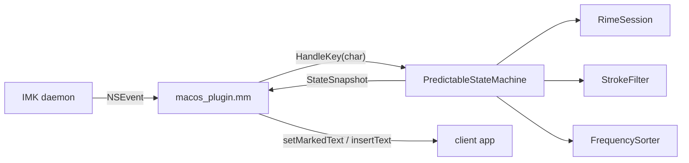

# Phase 8.3: macOS Input Method (IMK)

Plan for the macOS build of Predictable Pinyin. Linux ibus is done
(see [phase-8-ibus-linux-plan.md](./phase-8-ibus-linux-plan.md)); macOS
mirrors the same architecture.

## Design Highlights

| Aspect | macOS |
|--------|-------|
| Plugin model | `.app` bundle under `/Library/Input Methods/` using the Input Method Kit (IMK) |
| API style | `IMKInputController` subclass, Objective-C++ (`.mm`) |
| Registration | `Info.plist` keys (`InputMethodConnectionName`, `InputMethodServerControllerClass`, `ComponentInputModeDict`) |
| Icon | `PredictablePinyin.icns` in `Contents/Resources/`; generated from `data/icons/predictable-pinyin.png` |
| Rime user data | `~/Library/Rime/` |
| Rime shared data | `PredictablePinyin.app/Contents/SharedSupport/` |
| Build output | `build/PredictablePinyin.app` (CMake `MACOSX_BUNDLE`) |
| Dependencies | `librime` (Homebrew), `pkgconf` |
| Process lifecycle | Launched on demand by the IMK daemon; runs `NSApplication run` |

## Architecture



Same shape as the ibus plugin (`src/ibus_plugin.cc`): `pp_core` owns all
input-method logic; the macOS layer only translates NSEvent→char and
reflects `StateSnapshot` into IMK calls.

## Files

New files:

| File | Purpose |
|------|---------|
| `src/macos_plugin.mm` | `IMKInputController` subclass + `main()` |
| `data/macos/Info.plist.in` | IMK bundle metadata (paths templated by CMake) |
| `data/macos/PredictablePinyin.icns` | App icon (generated by `scripts/build-icns.sh`) |
| `scripts/build-icns.sh` | `iconutil`/`sips` helper that regenerates `PredictablePinyin.icns` from the PNG |
| `scripts/install-macos.sh` | Build, ad-hoc sign, copy to `/Library/Input Methods/`, seed `~/Library/Rime/`, deploy |
| `scripts/uninstall-macos.sh` | Inverse of install |
| `scripts/build-dmg.sh` | `hdiutil` wrapper producing `build/PredictablePinyin.dmg` |
| `doc/phase-8-macos-plan.md` | This plan |
| `doc/dev-setup-macos.md` | Dev setup, install, troubleshooting |

Modified files:

| File | Change |
|------|--------|
| `CMakeLists.txt` | `if(APPLE)` branch: find `InputMethodKit`/`AppKit`/`Foundation`, add `MACOSX_BUNDLE` target, stage data into `Contents/SharedSupport`. Also made `pp_core`'s `target_link_directories` PUBLIC so downstream executables link librime from Homebrew. Added `${RIME_INCLUDE_DIRS}` + `${RIME_LIBRARIES}` to `pp_core_tests` so it builds on macOS. |
| `tests/test_support.h` | Explicit `long long` cast on `file_time_type::...count()` to avoid an ambiguous `std::to_string` overload on libc++ (macOS). |
| `scripts/download-data.sh` | Updated `pinyin_simp.dict.yaml` SHA256 pin to the current upstream (unrelated drift, caught by the first build). |
| `README.md`, `doc/README.md`, `doc/plan.md`, `src/README.md` | Index and doc-link updates |

## Implementation notes

1. **Objective-C++ for the bridge**: `src/macos_plugin.mm` includes
   `predictable_state_machine.h` directly so there's no FFI layer.
   ARC is enabled for the `.mm` file only.
2. **Key translation**: work off `event.charactersIgnoringModifiers`
   rather than `keyCode`, so shifted punctuation (`!`, `?`, `<`, `>`)
   maps cleanly. Special keys (space/backspace/tab/return) are
   handled via `keyCode` (`kVK_Space` = 49, `kVK_Delete` = 51,
   `kVK_Tab` = 48, `kVK_Return` = 36, `kVK_ANSI_KeypadEnter` = 76).
3. **Shift toggle**: mirrors the ibus plugin — `flagsChanged` events
   record a "shift-only" state on Shift-down; on Shift-up with no
   intervening non-Shift key, toggle `_chineseMode`.
4. **Pass-through**: any event with Ctrl/Alt/Cmd modifiers returns
   `NO` from `handleEvent:` so the host app receives the combo.
5. **Bundle-relative data paths**: resolved at controller init via
   `[[NSBundle mainBundle] sharedSupportPath]`. All overrides
   (`PREDICTABLE_PINYIN_{SHARED,USER,PRISM,STROKE_DICT,HANZI_DB,PINYIN_DICT}_PATH`)
   match the ibus plugin's env vars for parity.
6. **Ad-hoc signing**: `scripts/install-macos.sh` runs
   `codesign --sign -` on the installed bundle so Gatekeeper lets it
   load. Developer ID signing + notarization is out of scope.
7. **Accessory activation policy**: `main()` calls
   `[NSApp setActivationPolicy:NSApplicationActivationPolicyAccessory]`
   before `[NSApp run]`, so macOS keeps the process alive as a
   background input-method server instead of auto-terminating it for
   having no open windows.
8. **TIS registration CLI**: `main()` also exposes
   `--register-input-source` (calls `TISRegisterInputSource(bundleURL)`)
   and `--enable-input-source` (flips `TISEnableInputSource` on each
   `im.predictablepinyin.PredictablePinyin.*` mode). The install script
   invokes both after copying the bundle — without this step, TIS does
   not pick up newly-added bundles in `/Library/Input Methods/`, so the
   input source never appears under System Settings. Mirrors the flow
   used by Rime/Squirrel's `--register-input-source` and Apple's TIS
   APIs in `Carbon/HIToolbox`.

Installed file paths are listed in
[dev-setup-macos.md § Installed Files](./dev-setup-macos.md#installed-files).
Source of truth for the build wiring is the `if(APPLE)` branch in
`CMakeLists.txt` — `pp_core`'s `target_link_directories` is `PUBLIC`
so downstream targets pick up Homebrew's librime prefix.

## Verification

**Automated** (unchanged — `pp_core` tests are platform-neutral):

```bash
./scripts/build.sh
cd build && ctest --output-on-failure
```

76 tests pass on macOS (Apple clang, arm64).

**Manual** (follows `README.md` §Manual Verification 1–11):

1. `brew install librime pkgconf`
2. `./scripts/install-macos.sh`
3. System Settings → Keyboard → Input Sources → + → Chinese
   (Simplified) → "Predictable Pinyin". Switch to it via menu-bar
   picker or Ctrl+Space.
4. Walk through the 11 manual-verification items in the root README.
5. Verify Shift toggles CN/EN, and Ctrl+C / Cmd+C pass through.

**Packaging**:

```bash
./scripts/build-dmg.sh      # → build/PredictablePinyin.dmg
```

## Risks

| Risk | Mitigation |
|------|------------|
| Gatekeeper blocks unsigned bundle | `install-macos.sh` ad-hoc signs; right-click-Open workaround documented. Real distribution needs Developer ID (future) |
| Homebrew librime path differs between arm64 / x86_64 | `pkg-config` resolves via `PKG_CONFIG_PATH`; `env.sh` + install script export it |
| IMK `InputMethodServerControllerClass` name mismatch | `Info.plist` and `@implementation PPInputController` both hard-code the name |
| First-run Rime deploy needs `rime_deployer` | `install-macos.sh` calls `$(brew --prefix librime)/bin/rime_deployer` up front |
| Shift conflicts with system shortcuts | Toggle only fires on pure Shift-up with no intervening keys |

## Work Breakdown (completed)

1. ✅ `data/macos/Info.plist.in` + `PredictablePinyin.icns` (via `scripts/build-icns.sh`).
2. ✅ `src/macos_plugin.mm` — port from `src/ibus_plugin.cc`.
3. ✅ `APPLE` branch in `CMakeLists.txt`.
4. ✅ `scripts/install-macos.sh`, `scripts/uninstall-macos.sh`, `scripts/build-dmg.sh`.
5. ✅ Build, 76/76 `ctest` pass, ad-hoc sign verified.
6. Pending: manual end-to-end verification on a signed-in macOS session.
