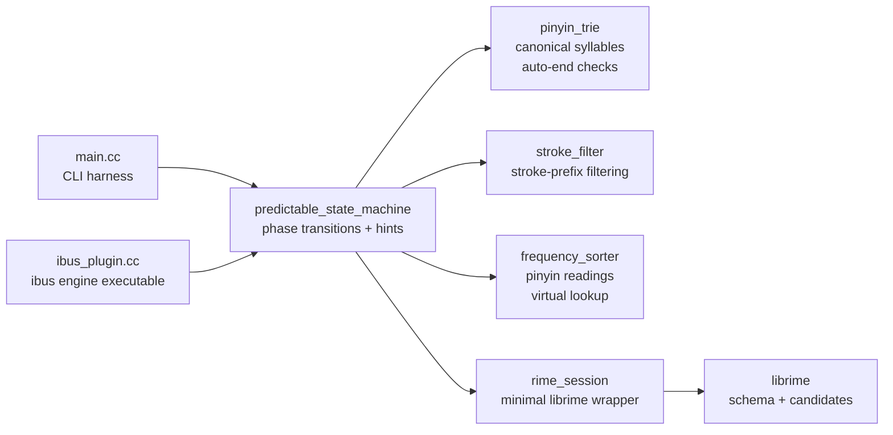

# C++ Prototype Layout

This folder contains the C++ prototype. It is intentionally split into small
pieces so that pure logic can be tested without needing a live `librime` session.

## File Roles

| File | Responsibility |
|------|----------------|
| `main.cc` | CLI harness: parses token args, creates session + machine, prints snapshots |
| `ibus_plugin.cc` | ibus engine: standalone executable with GObject/D-Bus bridge to the state machine; passes through Ctrl/Alt combos; Shift toggles Chinese/English mode with IBusProperty indicator |
| `macos_plugin.mm` | macOS input method: `IMKInputController` subclass + `NSApplicationMain` bridge to the state machine (Objective-C++, ARC); key translation via `NSEvent.charactersIgnoringModifiers` + `keyCode`; passes through Ctrl/Alt/Cmd combos; Shift toggles Chinese/English mode |
| `pinyin_trie.h/.cc` | Loads canonical pinyin syllables from `pinyin_simp.prism.txt`; provides syllable validation (auto-end is informational only); `Decompose` splits multi-syllable pinyin into individual syllables for virtual word composition |
| `rime_session.h/.cc` | Minimal wrapper around the `librime` C API for key input, candidate snapshots, and commits |
| `predictable_state_machine.h/.cc` | Core state machine: pinyin → stroke → selecting phases, hints, undo/backspace; apostrophe syllable separator; exact stroke match priority; partial commit with continuation to remaining pinyin |
| `stroke_filter.h/.cc` | Loads `stroke.dict.yaml`; per-character stroke filtering via segments; remaining-stroke lookups; `HasStrokePrefix` for single-char checks; `IsExactStrokeMatch` for exact match detection; `SplitUtf8` helper |
| `frequency_sorter.h/.cc` | Loads `hanzi_db.csv` + supplementary `pinyin_simp.dict.yaml` for multi-reading characters (多音字); validates candidate pinyin against all known readings (`MatchesPinyin`, `StripPinyinTones`); `CharactersForSyllable` for syllable-based virtual lookup |

## Structure



## Runtime Flow

1. `main.cc` or `ibus_plugin.cc` creates a `RimeSession`
   and `PredictableStateMachine`.
2. `PredictableStateMachine::Initialize()` loads canonical pinyin syllables from
   the deployed `pinyin_simp.prism.txt`, the stroke dictionary from
   `data/raw/stroke.dict.yaml`, the frequency database from
   `data/raw/hanzi_db.csv`, and supplementary multi-reading pinyin data from
   `data/raw/pinyin_simp.dict.yaml` (so characters like 的/沈/重 are found under
   all their pronunciations).
3. Each CLI token or ibus key event is converted to one
   logical key and passed to `PredictableStateMachine::HandleKey()`.
4. The state machine decides whether the key belongs to pinyin input, stroke
   input, or candidate selection. Rime receives keys incrementally during pinyin
   typing so candidates are available at every stage.
5. When candidates are needed, the state machine fetches them from `RimeSession`,
   passes them through `StrokeFilter` with per-character stroke segments.
   When multiple stroke segments are used, `ComposeVirtualCandidates` decomposes
   the pinyin buffer into syllables via `PinyinTrie::Decompose`, finds single
   characters matching each syllable + stroke prefix, and builds composed words
   even if Rime's dictionary doesn't contain the exact word.
   For single-syllable input without apostrophe, multi-char candidates are
   filtered out and single-character candidates are validated via
   `FrequencySorter::MatchesPinyin`; for multi-syllable or apostrophe-separated
   input, trusts Rime entirely. Candidate order otherwise stays in Rime order.
   After strokes are typed, exact stroke matches are stably promoted above
   prefix-only matches. When committing a partial match (single char from
   multi-syllable input), `ComputeRemainingPinyin` determines the unconsumed
   syllables and re-enters them for continued input in stroke phase.
6. When Rime state (preedit, raw input) is needed, the state machine asks
   `RimeSession` for a context snapshot.
7. The snapshot also includes `candidate_labels`: in stroke input these show the
   full remaining stroke sequence for each candidate; in selecting they show
   J/K/L/F relative to the current selection. TAB in stroke phase autocompletes
   strokes shared by the top 2 candidates.
8. `ibus_plugin.cc` renders the resulting snapshot into the framework's preedit
   text, auxiliary hint text, and candidate list with labels. Hints are kept out
   of preedit so editors never receive hint text as committed composition.

## Tests

Current unit tests live in `tests/`:

| File | Purpose |
|------|---------|
| `tests/pinyin_trie_test.cc` | Verifies canonical syllable loading and auto-end behavior without `librime` |
| `tests/predictable_state_machine_test.cc` | Verifies `;`→stroke transition, J/K/L/F from stroke entering selection, d-as-stroke-key, SPACE commit, undo/backspace, and selection commit |
| `tests/stroke_filter_test.cc` | Verifies per-character stroke filtering, `RemainingStrokesForSegment`, `SplitUtf8`, word-level matching, and integration with `PredictableStateMachine` |
| `tests/frequency_sorter_test.cc` | Verifies pinyin-reading validation, Rime order preservation, and the `yue` polyphone ordering regression |
| `tests/integration_test.cc` | End-to-end: full flow, SPACE commit from all phases, `;` enters stroke, d-as-stroke-key, incomplete pinyin commit, pinyin prefix+exact filtering, candidate labels (full remaining strokes), TAB stroke autocomplete (shared prefix, single candidate, divergent, partial), multi-reading chars (多音字: de/di, chen/shen, zhong/chong), backspace boundaries, deterministic ordering, word input (per-character stroke narrowing, skip-char `;;`, segment backspace, Rime ordering), multi-syllable pinyin (including virtual word composition from single chars), consistent ordering across phases, all punctuation (13 keys from idle, commit+punct from active phases, `;` idle vs active distinction), apostrophe syllable separator (single-syllable filtering, word enablement, multi-syllable passthrough), exact stroke match priority, partial commit with continuation |

Shared test utilities (`FakeSession`, `ScopedDirectoryCleanup`, sample data
writers) live in `tests/test_support.h`.

Run them from the project root:

```bash
./scripts/build.sh
cd build
ctest --output-on-failure
```

The tests use Catch2, and CTest discovers each test case separately so failures
show up with meaningful titles.

## clangd

For jump-to-definition and include resolution, make sure clangd can see the CMake
compile database generated at `build/compile_commands.json`.

Two practical options:

```bash
clangd --compile-commands-dir=build
```

or

```bash
ln -sf build/compile_commands.json compile_commands.json
```

## Maintenance Notes

- Keep pure logic in small helpers like `pinyin_trie`, `stroke_filter`, and
  `frequency_sorter` so tests stay lightweight and `librime`-free.
- Avoid making the CLI harness own core logic; it should mostly parse tokens,
  create the session, and print snapshots.
- If later phases introduce more pure data processing, prefer placing that logic
  behind small testable classes similar to `stroke_filter` and `frequency_sorter`.
- For local CMake builds, prefer `--parallel` with `max(1, cpu_count - 1)` jobs,
  matching the root `README.md`, by reusing `./scripts/build.sh` rather than
  duplicating shell snippets across docs or commands.
- For packaging on this machine, use `./scripts/cpack.sh` instead of raw `cpack`
  so it reuses the local environment fix from `env.sh`.
